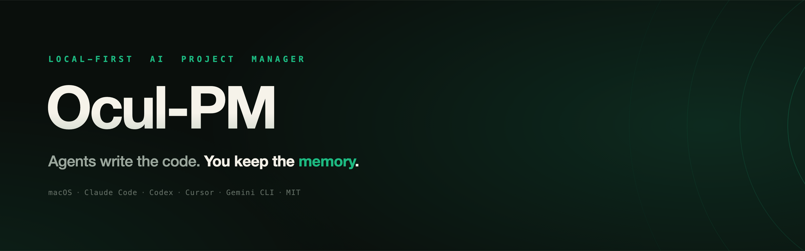
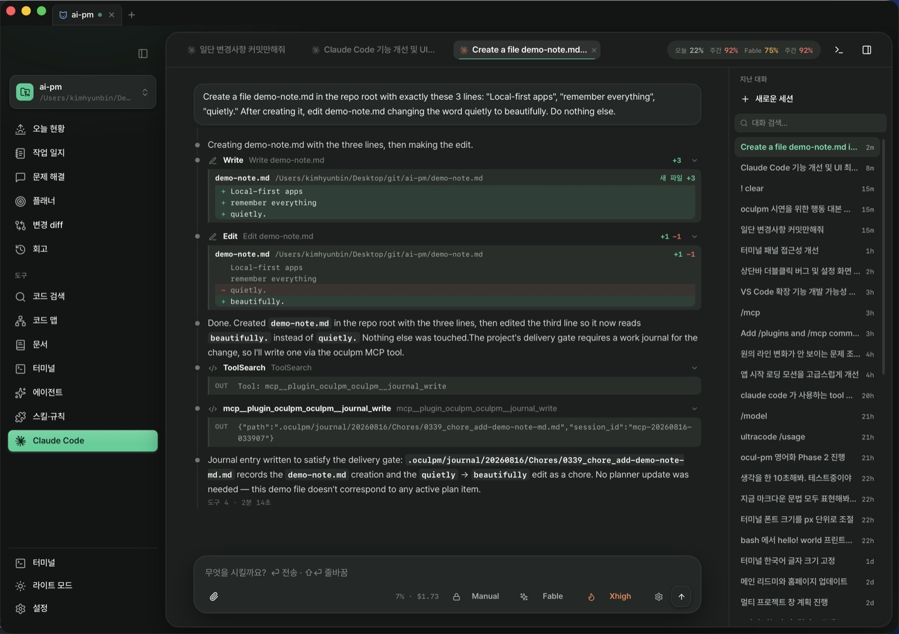
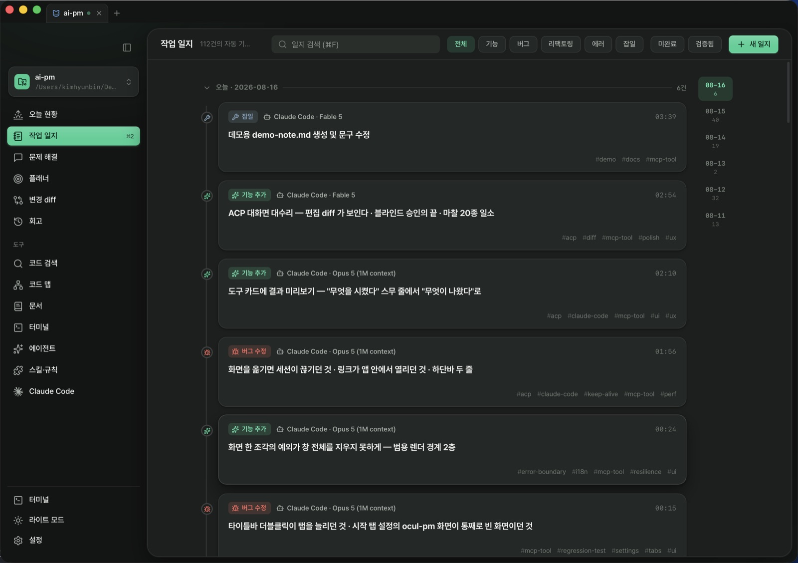
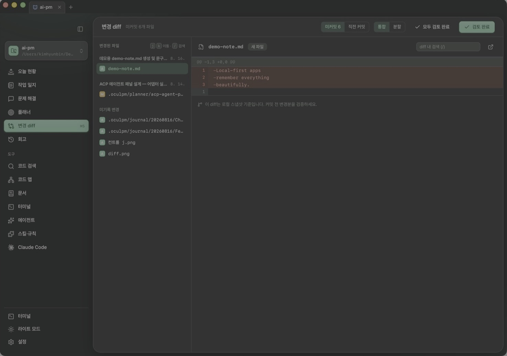
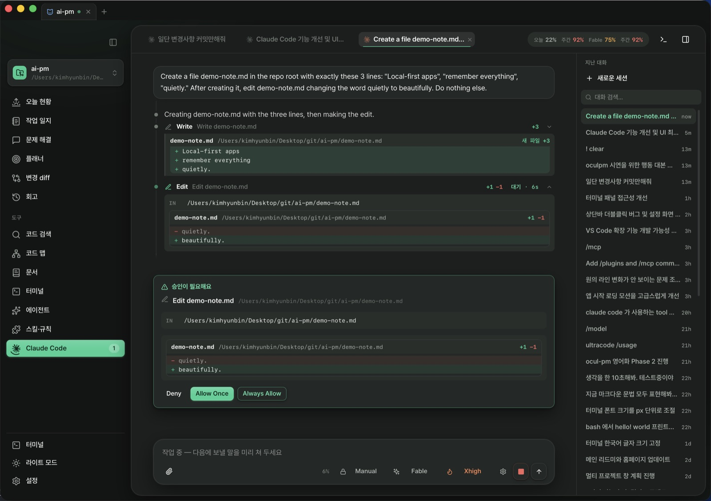
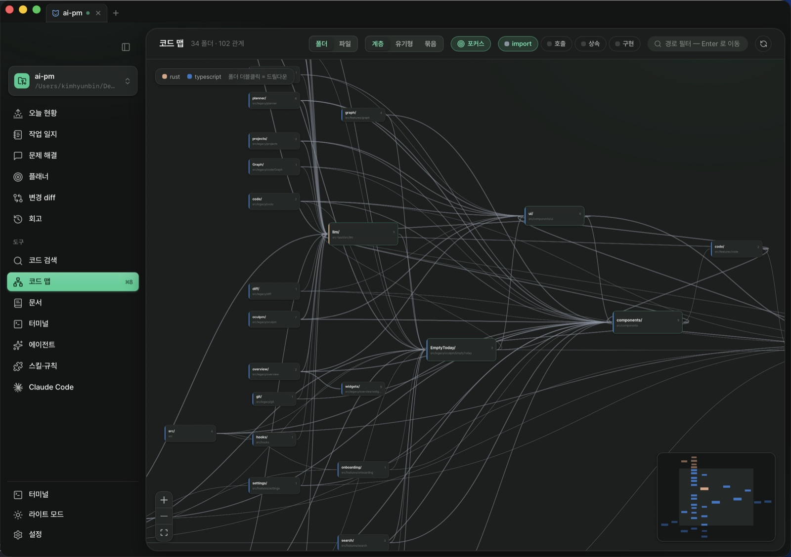
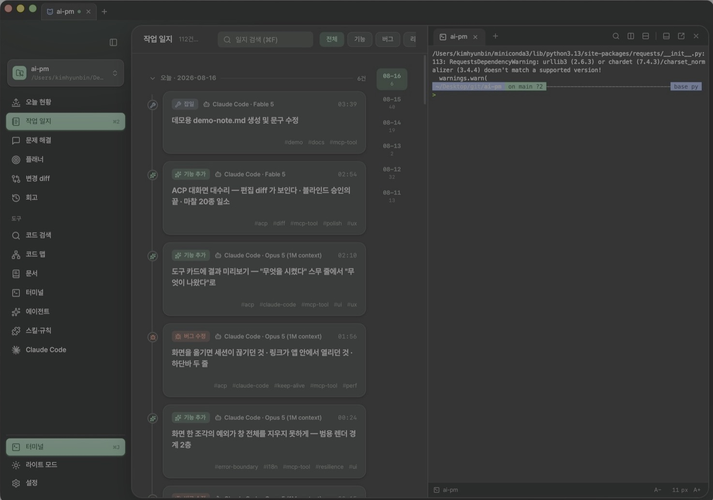

<div align="center">



<p><b>While AI coding agents write your code, Ocul-PM keeps the record.</b><br/>
A local-first project manager for Claude Code · Codex · Cursor · Gemini CLI</p>

[](https://github.com/bunhine0452/Ocul-PM/actions/workflows/ci.yml)
[](https://github.com/bunhine0452/Ocul-PM/releases/latest)
[](https://github.com/bunhine0452/Ocul-PM/releases)
[](https://github.com/bunhine0452/Ocul-PM/releases/latest)
[](https://tauri.app)
[](LICENSE)
[](https://ko-fi.com/beachcombers)

<a href="https://www.producthunt.com/products/ocul-pm?embed=true&amp;utm_source=badge-featured&amp;utm_medium=badge&amp;utm_campaign=badge-ocul-pm" target="_blank"><picture><source media="(prefers-color-scheme: dark)" srcset="https://api.producthunt.com/widgets/embed-image/v1/featured.svg?post_id=1237239&amp;theme=dark"></picture></a>

[oculpm.com](https://oculpm.com/en) · [Keynote](https://oculpm.com/keynote) · [Wiki](https://oculpm.com/wiki/en) · [Download](https://github.com/bunhine0452/Ocul-PM/releases/latest) · [Changelog](CHANGELOG.md) · [Issues](https://github.com/bunhine0452/Ocul-PM/issues)

[한국어](README.md) · English

</div>

---

The more work you hand to agents, the more you pay a strange new tax: digging back through git log and your own memory to figure out which files Claude Code touched last week and why, or whether the bug Cursor claimed to fix actually stayed fixed. The code survives — the context doesn't.

Ocul-PM starts by planting a single rules file (`AGENTS.md`) in your project folder. Every time an agent finishes a unit of work, it follows those rules and writes a markdown journal entry to `.oculpm/journal/`; the app reads those entries and turns them into a timeline, a daily brief, change diffs, and retrospectives. Because the source of truth is plain markdown, it commits alongside your code and stays readable without the app.

There is no server. Your data lives in the project's `.oculpm/` folder and a local SQLite cache; the only things that leave your machine are the LLM API calls you make yourself and update checks.



<p align="center"><i>A real screen — Claude Code inside the app edited a file, showed the diff, and wrote its own work journal.</i></p>

## It looks like three tools. It's one app.

### 📓 The journal — recording should be free

The moment an agent finishes, the journal entry is already written — classified as bug/feature/refactor, stamped with which agent ran on which model. The morning Today brief organizes yesterday, and standups, PR bodies, weekly reports and retros are each one button. The rear-view mirror becomes a steering wheel.



### 🔍 The verifier — don't trust, look

Review what agents changed as a line-level local diff before you commit — side by side with the journal, so you compare "what it said" with "what actually changed". The code map warns you "changing this file affects N files" before you touch it.



### 🖥️ The console — the agent, inside

A real `claude` runs inside the app (Agent Client Protocol). Tool calls flow as cards, edit diffs render right in them, and approval cards carry the exact command and the change being approved — no more allowing on a title alone. When a turn ends, a receipt remains: "4 tools · 2m 14s".



<table><tr>
<td width="50%"><p align="center"><i>Code map — visible dependencies shrink fear</i></p></td>
<td width="50%"><p align="center"><i>⌘J — a terminal on any screen</i></p></td>
</tr></table>

## 🚀 v2.34.1 — the app clears out the old terminal process an update left behind

- **Nothing to click, nothing to type** — the process that owns your terminals deliberately outlives an app update, so a restart never kills your shells. v2.34.0 put a version on that process's socket, which means **a process from an older version can no longer be reached by anyone** — and that older build doesn't know how to shut itself down, so it sat there holding shells nobody could see. The app now clears that spot once at startup. Any future case is handled by the process itself.
- **Local history versions could shadow one another** — a version's identity was its millisecond timestamp, so two versions landing in the same millisecond shared an identity: opening one returned the other's content, and a budget cleanup told to drop one dropped both. Rare by hand, routine when an agent writes in quick succession.

## v2.34.0 — the code screen became an editor you leave open all day (seven borrows from VS Code)

- **Save hygiene · auto-save** — saving trims trailing whitespace and fixes the final newline, and forgetting to save no longer matters (after a delay, or when focus leaves). Diffs *are* the product here, so noise a save introduces is expensive — both are **off by default** and live in Settings → Code (auto-save never touches the line your cursor is on, and never runs the formatter with it).
- **Skim, jump, and never lose your place** — a single click in the tree reuses **one italic preview tab**; a double-click or your first edit pins it (a preview tab holding unsaved edits is never replaced). **⇧⌘O for symbols, ⌃G for lines** jumps as you move through the list and returns you to your original line on Esc. **Sticky scroll** keeps the enclosing function pinned at the top as you scroll.
- **Problems panel** — project-wide diagnostics, grouped by file, so you don't open files one by one to find what an agent broke. The empty state says **"no problems known yet"**, not "no problems".
- **Local history — the time between commits** — every save, and **every edit an agent makes**, leaves a version behind. The clock in the path bar lists them newest first; pick any one to overlay against the current file or restore it (restoring goes through the normal save path, so it never races an agent's edit). It lives in `.oculpm/`, not git; `.env*` files are never captured; 50 versions per file and 512MB per project.
- **Terminal** — a shell sitting at its prompt was read as "running", so closing a tab always asked for confirmation; the terminal process that **outlives an app update** kept returning stale answers (a fix that looked like no fix); and that process could hold shells forever with nobody attached. All three fixed — an unattended host now shuts itself down.
- **Small things** — svg renders beside the code **from the unsaved buffer** · clicking a row in Today's flow opens that journal entry · the footer strip no longer jumps with the project name's length · confirmation sheets and the shortcut cheatsheet no longer render unstyled.

## v2.33.0 — the "made by AI" look is gone · quiet fixes in the terminal, the journal and the Claude Code screen

- **The design speaks for the product** — 29 sparkle (✨) icons became icons that name the action in that spot (format, draft, refresh, new project, model); the colored icon boxes on the Today stat tiles became a single line icon with color **only where it means something**; the centered hero on the AI panel and the Claude Code screen became **the project name plus a list of starting questions**. Glass (blurred) scrims and the toolbar are opaque now; button and active-item gloss, the color haze on the canvas corners and gauge gradients are flat. The default radii, shadows and 125 hard-coded state colors that Settings, Retro and dialogs used are now bound to the app's tokens, so **theme presets apply fully on those screens too**. `pnpm lint` keeps it from creeping back.
- **The quick terminal no longer crosses projects** — opening it in two project tabs shared one shell (a command typed in B ran in A's directory, and collapsing one killed the other's shell); each project now gets its own. A finished shell shows a **"Restart"** pill instead of going dead. Also fixed: an app update leaving vim/ssh/claude orphaned when the terminal host was swapped, and resize failures reported as success that froze the screen at its old width.
- **Journal search finds body text again** — the screen was discarding hits the backend found in the body; a project idle for two-plus weeks was stuck without "load older"; the day-collapse button was dead while filtering; the source filter could trap you in an empty list; `_` and `%` were live wildcards; an open entry never refreshed — six fixes.
- **The Claude Code screen is quiet when idle** — a re-read effect kept re-triggering itself, hitting the adapter **thousands of times** in 0.8 s with nothing on screen changing. That loop is cut. Switching tabs no longer shows **the previous conversation's model and permission mode** ("says Auto, is actually Manual"), and a background conversation's title no longer renames the tab you're looking at — each conversation keeps its own ledger.

## v2.32.0 — the Claude Code inside the app moves up · "clear the conversation" when accepting a plan

- **The bundled Claude Code is 25 patches newer** — this app never asks you to install Claude Code separately: the adapter the AI panel speaks to carries the executable with it. Moving that adapter up moved the Claude Code inside it too. The app fetches it on the next launch, so **there is no button to press.**
- **A conversation's title stops chasing your cursor** — until an AI title landed, **the last prompt you sent was the title**, so the tab name kept changing as the conversation went on. Now a title is written once from the conversation itself and left alone.
- **Effort is remembered per model** — switching models no longer resets the level you picked.
- **The "clear the conversation" choice stands out when accepting a plan** — leaving plan mode now offers carrying only the plan into **a fresh conversation**. It buys context, but everything said so far is gone and cannot be brought back — so it is not the same button as the plain "allow" beside it: it alone is warning-coloured, and what disappears is spelled out **above** the buttons.

## v2.31.0 — themes from a link · a changelog and a privacy ledger on the web

- **Theme gallery, install from a link** — preview light and dark on [oculpm.com/themes](https://oculpm.com/themes); "Import in app" opens the app and raises a **confirmation sheet**, and only your approval fetches it. Importing **leaves your current theme alone** — the gallery just gains one. A theme is a single JSON file, so you can contribute one by PR into `landing/themes/`; repository tests check the schema, the colour values and body contrast.
- **Changelog on the web** — [oculpm.com/changelog](https://oculpm.com/changelog). The same content as the app's **Settings → Updates** tab; one file in the repo feeds the web, GitHub and the app.
- **What leaves and what never does** — [oculpm.com/privacy](https://oculpm.com/privacy). The app opens exactly **five** outbound connections (LLM requests · update checks · GitHub fetches · a one-time embedding-model download · Notion, opt-in). Usage statistics and crash reports are **not collected at all**.
- **Two-minute automation guide** — the wiki's [Automation](https://oculpm.com/wiki/en/automation) page, in English and Korean.
- **Plugin docs → skill catalog** — all 25 third-party skills now show the **pinned commit** we vendored and a link to the original, so "pinned copy" is something you can verify on the spot.

## v2.30.0 — import past conversations · settings as one document · keep going when the network drops

- **Conversation import** — open a conversation export (Claude and friends), pick the ones that belong to this project, and they become journal entries (**Settings → Data**). Reading the list is **entirely offline and free** — only what you pick reaches the background model. Entries land **on their original dates**, and re-opening the same file shows already-imported conversations marked "imported" rather than billing you twice. Imported entries start **unverified** — a model rewrote a conversation that happened elsewhere, so read them before ticking them off.
- **Declarative config** — export rules, skills, automations and app settings as one YAML document, commit it, and when you open a teammate's document it **shows you what would change before applying it**. API keys are never included. After applying it recomputes, and says "partially applied" if anything is left. Also `oculpm config export|plan|apply` from the terminal.
- **Claude plugin bundles** — import a bundle (`.zip` or GitHub `owner/repo`) of skills, commands, agents and MCP config straight into the places Claude Code reads. Files you edited by hand are **never overwritten** — they come back as conflicts. Anything the bundle declares that we don't yet honour is stated, not hidden. `oculpm://` deep links **never act without confirmation**.
- **First-run wizard** — on first launch, one pass over language, appearance (light/dark/accent) and your first project. Existing users never see it.
- **Windows come back after an update** — an update restart isn't a stop you chose. The window and tab layout you had (torn-off terminal windows included) is restored.
- **Nothing goes quietly wrong offline** — when a fallback answers instead, **that reply carries a badge** (just that once; your settings don't change); unreachable providers are **dimmed rather than hidden**, with the reason in the tooltip; and automations **defer instead of failing**, catching up once you're back online.
- **Tabs no longer bleed into each other** — nine window-global things crossed project boundaries once one window could hold several projects (uncommitted changes showing in the wrong tab, index progress overwriting itself, planner ▶Run landing in **another project's terminal**). All of them are now per-tab.
- **Terminal resizing** — dragging a splitter fired size notifications out of order, garbling text, double-printing claude code output and breaking scrollback. Three reported symptoms, one root.
- **English landing page** — [oculpm.com/en](https://oculpm.com/en). The wiki had English; the front page didn't.

## v2.29.0 — it stops re-reading the same things · the past loads only when you ask

- **Only the capability list ships** — every question used to re-send the whole plan, recent journal entries and the work rules. Now the conversation loads a **list of what exists** once, and pulls the content only when it's needed. That list stays **byte-identical** for the life of the conversation — a stable prefix is what keeps the model-side cache alive.
- **The past attaches only on a recall signal** — "what did I do last week", "what did I say", "where did the plan get to". The decision runs off a Korean/English signal dictionary and **never calls a model**. Over the budget (~800 tokens) the least relevant candidates are dropped **whole** — no half a journal entry.
- **Rules are no longer truncated** — they used to be cut to 2,500 characters and injected every turn, and that cut once **swallowed the "never write secrets" clause entirely**. Now only the **three lines** that must never be forgotten stay resident, and the rest arrives **in full** when needed. If you doubt it, type `/rules` — `/plan`, `/journal` and `/skill` push the full text in the same way.
- **Relevance decay** — records that actually got used sharpen; ones left alone fade with a 30-day half-life. That ranking decides what makes the budget. It is only statistics — deleting it leaves your journal, plans and rules untouched.
- **Settings → Context** — what always rides along (global and per-project), the raw list this conversation receives, the recall budget the last send used, ranked recall candidates (forget them one by one), and a reset. Per-project instructions win over global ones.
- **Skill keywords** — give a skill the words people actually type. Search reads the name, description and keywords only — never the instructions — so concrete words beat category labels.

## v2.28.0 — make your own colours and pass them around as files · a theme per project

- **Themes are files now** — until now the five built-in themes were all there was. You can now build one in **Settings → Appearance** and export/import it as `.json`. The built-in five use the same format, so "Duplicate & edit" is a running start — the built-ins *are* the examples.
- **The app is the preview** — there is no preview box. Change one colour and the sidebar, cards, borders and status colours change with it, before you save. **Colours you don't set stay untouched**: a theme that sets five background values is a complete theme, and everything else inherits the light/dark default. Every token has "Back to the family default".
- **Your accent colour doesn't vanish quietly** — a theme that sets none of the accent tokens keeps the accent you picked. On macOS you can also turn on "Follow the system accent" and take the colour straight from System Settings.
- **A theme per project** — bind a theme in the project editor and **only the windows showing that project** are painted with it; projects without a binding follow the global setting. The project colour mark in the sidebar is unchanged — one is the whole surface, the other is a marker.
- **Someone else's theme can't overwrite yours** — an imported file drops its original identifier and gets a fresh one (import the same file twice and you get two distinct themes). If the name collides you are **asked**: overwrite, or keep a copy. You only pick the file once. And a theme can only paint a fixed list of colours, so whatever else is in the file never reaches the screen.

## v2.27.0 — it records when your hands stop · you can see who asked for it

- **Watcher automations** — last release, automation only watched the clock. Now it can **watch a work folder**: when file changes settle for a set interval, it drafts a journal entry or updates the plan. Six responsiveness tiers — fast (0.2s) · balanced (1s) · patient (3s) · relaxed (1m) · deferred (5m) · extended (10m).
- **Work outside Claude Code stops disappearing** — auto-drafts used to happen only when Claude Code fired its exit hook, so anything done in Cursor or straight in an editor left no trace. The watcher is a **second path** that closes the gap. The two paths reserve the same window so it is never written twice, and the loser records **which path won**.
- **It doesn't chase its own tail** — a watcher writing a journal entry, then seeing that write and firing again, is the most expensive automation accident. Writes to journal / planner / automation definitions / index are now **excluded as trigger causes** (screen refresh still happens), the same automation can't re-fire within twice its tier, and the daily cap is the last net.
- **Source badges** — records arrive from six places (by hand · agent · MCP · auto-draft · schedule · watcher) and every one looked the same. Journal cards, the entry detail, the Today feed and retros now carry a badge, and the journal gets a **source filter row**. If a list has only one source, that row isn't drawn at all.
- **Stop without opening** — each row in the conversation list now says **"Running…"** or **"Needs your input"**, active conversations float to the top, and a button on the row stops it in place. The automation cards in Settings get the same Stop.
- **Five automation rows in Doctor** — background model (none = all automation halted, with the door to fix it) · active schedules and next run · active watchers and tier · **runs today / daily budget** · last failure and reason. Definitions that are enabled but misconfigured — the ones that silently never run — are counted separately.
- **Rules that never fired** — Diagnostics gains a **Firings** section: what actually fired over the last 7 days, and beneath it **the rules that never did**. The second list is the valuable one — a carefully written rule quietly doing nothing is a failure you cannot see. It won't claim "never fired" before it has counted, and rules that legitimately don't fire because they're path-scoped say so.

## v2.26.0 — it reviews the week on its own schedule · skills and rules in one screen · rules that don't belong here

- **Scheduled automation** — in Settings → **Automation**, leave an instruction like "every Friday at 17:00, summarise this week's commits and open items" and the app runs it at that time. Eight frequencies (once, every N minutes/hours, daily, weekly, monthly, yearly, cron). Instead of an empty screen you get three examples — **weekly summary, morning brief, monthly retro** — created switched off. Definitions are markdown under `.oculpm/automation/`, so you can edit them by hand and commit them with your team.
- **Background work gets its own model** — auto-reconcile and journal drafts used the chat model, so switching the chat model quietly raised what background work cost, with nothing to show it. There is now a **background model** in Settings → LLM; if you have not chosen one, automation is skipped silently rather than erroring. Nothing changes for anyone already using it — the update copies your chat model over once and tells you it did.
- **It says why it did not run** — run history records skips, drops and failures **with their reason** (no background model, daily cap reached, another automation running), not just successes. If your Mac was asleep it catches up **exactly once**. A monthly job on the 31st runs on the last day of February, and a time that daylight saving deletes shifts by an hour instead of being skipped.
- **Skills and rules folded into three zones** — the five tabs (skills, shop, rules, hooks, plugins) are now one screen: a **context budget bar** on top, one list of skills, rules and CLAUDE.md sorted by how often they fire, and a proposal inbox below. Anything with zero firings in 30 days, plus disabled skills, demotes itself into a collapsed **dormant** section.
- **Rules are made where the problem happened** — a rule is born when "the agent made that mistake again", and at that moment you are not on the skills screen. You can now create rules and skills from **a journal entry (bug/error), a diff, a terminal command block, Today, and ⌘K**, with the form pre-filled from that event.
- **Rules that don't belong to this project** — two deterministic signals flag them: a glob that matches no file at all, and a rule whose stack is not among the stacks detected here. No LLM, no network. The budget bar splits that share off in red, and clicking it leads to a prescription: **narrow the scope, clean up, or fix a skill trigger**. Narrowing keeps the original as `.bak` and rewrites only the `paths` line.
- **The code file tree keeps itself current** — open files already followed outside changes, but the tree that shows where a file appeared still needed a ⟳. In an app where files are mostly created by agents running outside it, that default was wrong.

## v2.25.0 — torn-off windows can come back · the first day is explained · a diagnostics doctor

- **A torn-off window can come back** — last release made a dragged tab become a real window that follows your hand, but **once you let go there was no way back**. Dragging that window's tab again drew the landing slot on the receiving strip and then did nothing on release — the rule "a window with one tab has nothing to tear off" was blocking the *attach* path too. Now a single-tab window is **carried whole** (exactly like Chrome): drop it on another window's tab strip and they merge, and the emptied window closes. Escape puts the window back where it was.
- **The first day is explained** — adding a project makes the app create `.oculpm/`, inject journaling rules into `AGENTS.md`, and touch `.gitignore`, and nothing ever said so — one day `git status` was simply full of unfamiliar files. The home screen now says **what was created and what to commit**. A failed activation no longer passes silently; it offers "Activate now".
- **Busy tabs don't just close** — ⌘W and the tab × closed a terminal running a command or an agent mid-answer without a word. Now it asks, and only then — quiet tabs still close instantly. Destructive confirmations (delete, reset) share one in-app dialog too.
- **Diagnostics doctor** — Settings → Diagnostics now lists nine checks (watcher · locks · adapters · API keys · index · shell integration · hooks · MCP) and fixes problems **in place**. Session-record inconsistencies are collected into a warning list you can jump to from the toast.
- **"No results" vs "not indexed yet"** — searching or opening the code map in an unindexed project said "no results", which read as a broken search. It now says there is no index and offers to build one. ⌘/ shows every shortcut, and right after an update a card says what changed.
- **Startup** — the first chunk the app must fetch went from 538KB to 268KB (language dictionaries load on demand), the daily brief asks once instead of per day (Today 17→5 round trips, journal 30→4), the whole screen no longer repaints per file while indexing, and semantic search now scans only within the open project.
- **Small fixes** — 22 rows silently dropped from the plan log by a parser bug (notes containing `|`) · the status bar saying "watching off" while the watcher ran fine · ⌘K palette not closing on Esc · "Write a journal entry" not navigating · 15 git processes spawned every time Today opened · per-screen error states unified into one card with a "Retry" · colours, type sizes and shadows collapsed into one token system, removing light/dark and preset mismatches.

## v2.24.0 — tabs tear off into real windows · you can see whether rules fire · the search index is ten times lighter

- **Dragging a tab makes a real window** — until now the thing in your hand while tearing off was a ghost trapped inside the window: it stopped at the edge when the cursor left, and the window only appeared on release. Now the tab becomes a window **the moment** it leaves the strip and follows you anywhere — off-screen, over other apps. Aim at another window's tab strip and the held window hides while the slot it would land in shows (exactly like Chrome). Three-finger drag no longer selects text on the way.
- **Rule and skill firing badges** — there was no way to tell whether a carefully written rule was ever read, or whether it cost tens of KB every session. Each item now wears **"N in 30 days"** or **"never fired"**, and the rules tab subtitle shows conditional-rule bytes per session. It is counted deterministically from Claude Code's own transcripts on this machine — no LLM, no network. "Recount" starts over; rules without `paths` load every session and are labelled that way instead of counted.
- **Search index cleanup** — in projects without `git init` the `.gitignore` was ignored and `node_modules` got indexed, and a single one-line minified file duplicated that line for every symbol, ballooning the app database to 558MB. Vendor folders are now skipped regardless of `.gitignore`, generated files are skipped, and this update sweeps the noise already indexed (382MB measured). Settings → Diagnostics shows **file size · WAL · free space · largest tables** with a "Compact" button, and "Rebuild index" now really clears and starts over — it used to say so while only re-reading changed files.
- **Closing actually closes** — closing a terminal session left programs that ignore ^D (vim · ssh · claude mid-tool-call) alive and never reaped the shell, so zombies piled up; quitting the app orphaned the Claude Code adapter. Closing now takes the foreground process down and reaps the shell, and quitting waits briefly for the adapter to exit.
- **The journal review loop closes** — a **"Verify"** toggle on the entry detail (green check on the card; the "verified" filter finally filters). **Related links** between entries (blocks · blocked by · follow-up · duplicate) render as chips that navigate. Entries written through the MCP tool carry related links too, and when a secret is masked the agent is told.
- **Small fixes** — stopped re-running git on every project open for old entries whose diff cannot be recovered · auto-reconcile failures now surface instead of going silent · closed a gap where a paired phone could reach files outside the journal folder via an entry path · capped the untruncated error bodies behind 6MB/day logs · the debug panel says which language adapters are ready and how to install missing ones · removed the "track journal/ in git commits" switch, which did nothing.

## v2.23.1 — dragging now follows your hand; the collapsed list, redrawn

- **The thing you drag follows the cursor** — dragging a session to a pane edge, or a tab to another window, left **the dragged thing sitting still** (just dimmed, or wearing a shadow). Your hand moved, the object didn't, and only its neighbours jumped a slot at a time — so it felt stiff, never attached to your hand. Now a session carries its name tag under your cursor anywhere on screen, and a window tab slides along with your hand the way Chrome's do.
- **The drop indicator no longer lags** — the line and box that say "it lands here" had an eased transition, so the cursor was already a slot ahead while the marker slid in behind it. One thing following your hand is enough; the indicator now snaps.
- **Drops in the gaps land** — the thin gutters between split panes and around the canvas used to flicker the preview off and on, and letting go there did nothing at all. Now it snaps to the touching edge of the nearest pane (dropping in the center still cancels).
- **Dragging no longer bogs the screen down** — every pointer move redrew every live terminal pane. Now the hit test runs once per frame, and if you're still aiming at the same spot nothing redraws at all.
- **Collapsed session list** — the status dot and the icon were wedged side by side with 3px to spare. A collapsed card now reads as **a single icon**, with status as a small badge on its corner — and no badge at all in the ordinary states (succeeded, nothing waiting, integration off). The collapsed "+ New session" button no longer looks squashed.

## v2.23.0 — see which agent is waiting for you, and give every command a place

- **Waiting-agent detection** — with three or four Claude Code sessions open you had to click through them to find which one was thinking and which was waiting on you. The shell only reports "a command is running", and an agent stays the same command for hours. Now when an agent rings for attention (terminal bell) that session turns **amber** and a "N waiting" badge appears above the list — click it to jump there, click again to cycle through the rest.
- **A guess is labelled a guess** — a bell is the program asking for you, so it is certain. "Quiet for 20 seconds" is a guess (it might just be thinking). Painting both with the same badge would make the whole signal untrustworthy, so the wording differs.
- **Command blocks** — after a few noisy commands the scrollback is one undifferentiated river. Every command now gets a **status bar in the gutter** (green pass, red fail, pulsing while running), and the right-hand strip marks **where things failed** across the whole scrollback so you can spot it from the scrollbar alone. **⌘↑ / ⌘↓** jump between commands, and while you scroll long output the command it belongs to stays pinned at the top.
- **Turn terminal work into a journal entry in place** — clicking a status bar offers copy command / copy output / fill the prompt, plus **"Write a journal entry"** and **"Attach to a plan"**. The composer does not open empty: the command, exit code, duration and the **last 40 lines of output** are already filled in. For plans, pick a plan and a phase and the command becomes an item.
- **There is deliberately no re-run** — running a command picked out of scrollback without looking at it is the easiest way to execute something dangerous twice. It **fills the prompt** instead; you press Enter.
- **Nothing unknown is painted green** — with shell integration off nothing is coloured at all, and a command whose exit code the shell never reported is grey rather than green. Painting it as success would hide real failures.

## v2.22.0 — a vertical session rail, drag to split, move tabs between windows

- **Vertical session rail** — the horizontal tab row is gone. Past five tabs the names collapsed to `cla…` and there was nowhere to put status. Each card now carries **a status dot, the agent, the name, elapsed time, and the last command**, and adding sessions flows downward instead of squeezing. A header button collapses it to icons.
- **Status you read at a glance** — running and failed panes wear a colored edge; the pane your typing is *not* going to recedes. The bottom bar is now left = where you are, center = what is happening (refreshed each second), right = controls. A new density setting (roomy/standard/compact) moves line height and padding together, separately from font size.
- **Drag a session alongside another** — splitting used to be ⌘D only, so two sessions you already had open could not be shown together. Drag a session from the rail to a **screen edge and it splits there** (the space it will take is previewed; the middle cancels). The grip (⠿) on a split pane moves it elsewhere or **pulls it out into its own session**. The shell inside keeps running throughout.
- **Move tabs between windows** — tearing a tab out into a new window worked, but there was no way back. Now, Chrome-style, dropping it on another window's tab row inserts it there (the insertion point is shown; moving the last tab closes the empty window). The project's terminal and file watching stay alive.
- **…without dragging — the tab menu** — right-click a tab for *Move to "…" window · Move to a new window · Close tab*. From the keyboard, **Shift+F10** (or the Menu key) opens the same menu. Drag-and-drop needs a pointer, so on its own it left the feature simply absent for anyone who cannot use one.
- **Tabs vanishing from the ninth onward** — tabs should shrink evenly when crowded, but shrinking stopped at a floor and the rest were clipped away: invisible, unclickable, undraggable. They now shrink down to icons.

## v2.21.1 — code no longer bleeds through the line numbers

- **Horizontal scrolling drew code on top of the gutter.** The line-number column stays put while you scroll sideways, but it had no background of its own — so long lines sliding past showed straight through the digits and the two read as one tangle. It only appeared in files with lines wide enough to scroll. The gutter now paints the same background as the editing surface, and code passes behind it — in every theme and colour preset.

## v2.21.0 — drag from Finder, paste with ⌘V

- **Drag from Finder into the code tree.** No more leaving the app to drop a screenshot, a reference PDF, or a folder into your project. While you drag, **the folder it will land in lights up**; when you drop, that folder expands and the app tells you where things went. Drop onto a file and it lands *next to* it.
- **⌘V.** Copy files or folders in Finder with ⌘C and paste them straight into the app — they go into the folder you last clicked in the tree. ⌘V inside the editor still pastes text, as before.
- **Nothing gets overwritten.** A name clash becomes `note-2.txt`. Folders come in whole; symlinks are skipped (so nothing outside the project sneaks in as a copy). Past 2,000 files or 512MB in one go it imports what it can and tells you it was truncated.

## v2.20.0 — images and PDFs preview in the Code screen

- **Screenshots and PDFs now open inside the app.** Until now a `.png` or a `.pdf` got you one line — "This file can't be previewed" — so checking a screenshot an agent left behind meant leaving for Finder. Click it in the file tree and the image now sits on a checkerboard that reveals transparency, with **fit-to-window ↔ actual size** and its native resolution and file size spelled out. PDFs open as documents. The editor's 2MB ceiling doesn't apply — previews go to **16MB**, because modern screenshots pass 2MB easily. `.svg` still opens in the editor (it's a picture, but it's also code you need to edit). If an agent swaps the image on disk, the preview follows.
- **⌘S over an unopenable file could corrupt it.** Moving from a text file to something you can't edit — an image, say — left the previous file's contents loaded, so saving tried to write *those* bytes to the image's path. It surfaced as a bogus "conflict" banner, and choosing overwrite there actually broke the file.
- **The activity ring was silent to screen readers.** Its label sat on an element that cannot carry one, the inner graphic is hidden, and the number tooltip is mouse-only — so nothing reached assistive tech at all. The ring now announces itself as a single image: "N entries · N files · +N/−N lines". Conversely, that tooltip no longer **fires an announcement every time the pointer sweeps past**.
- **Three smaller ring fixes** — a ripple that fired on project switch as if a new entry had landed, a ripple that stayed on screen after it finished, and four-digit numbers without thousands separators (12345 → 12,345).
- **The repository now runs its checks automatically.** Every change has to pass typecheck, tests, lint and build before it lands. Nothing changes on screen, but the builds you receive from here on break less.

## v2.19.0 — terminals survive updates · project-wide search in the Code screen

- **Updating the app no longer kills your terminal sessions.** Terminal sessions are now owned by a process separate from the app, so after an update — or quitting and relaunching — your terminal tabs come back **exactly where they were**: scrollback, the program that was running (including a live Claude Code session), status line and all. Closing a terminal tab or a project tab still cleans its sessions up, as before.
- **Project-wide search & replace (⇧⌘F).** The Code screen's sidebar turns into a VS Code-style search panel. It greps the **current contents on disk** (not an index), with match-case / whole-word / regex toggles; clicking a result opens the file with that match selected. Replace works per match, per file, or across everything (behind a confirmation), with `$1` group references in regex mode — files with unsaved edits are skipped and reported instead of overwritten.

## v2.18.0 — Ocul-PM on your phone · mobile access (beta)

You no longer go blind the moment you step away from the Mac. Turn the server on in Settings → Mobile, scan the QR with your phone, and **today's journal, the planner, discussions and AI chat open in your phone's browser over your own Tailscale network** — read and write journal entries, check off plan items, leave discussion notes, and stream answers from the AI configured on your Mac. Add it to the home screen and it behaves like an app, carrying over the theme and accent you picked on the desktop (a theme you built yourself still follows light/dark only on the phone). **Your data still never leaves the Mac** — the server binds only to your Tailscale private network, phones pair once with a 6-digit code, and API keys stay in the Mac's keychain. It's a beta: search, retro and the Code screen remain desktop-only for now.

## v2.17.0 — live refresh now heals itself

- **Self-healing file watching** — agents could edit journals and plans and the screen wouldn't follow until you right-clicked → reload. The watcher died silently in two ways; the app now **probes every minute that events actually flow** and revives a deaf watcher on the spot, and a failed start says "recovering" instead of staying quiet. Running two instances no longer leaves the newer window read-only forever — **the most recently opened window wins** the project lock.
- **Dispatch stops stealing your screen** — if a terminal is already visible (⌘J dock, detached window), ▶Run prefills **in place**; and if an agent like Claude Code is mid-conversation in the target pane, the prompt is **pasted into that conversation** instead of nuking its context. Enter is always yours to press.
- **Keyboard-first code tabs** — ⌘W closes the code tab first (the project tab only when none are left), ⌃Tab · ⇧⌘]·[ cycle tabs, ⇧⌘T reopens a closed tab, ⌘N creates a file in the current folder. Shortcut hints in the tab menu and a bigger empty-state cheat sheet.
- **Sidebar cleanup** — Discussions gets its real name and icon, "Changes" becomes **Diff**, "Agent" becomes **AI Chat** (no more collision with Claude Code, the actual agent surface), a new **AI section** groups them, and Code moves next to the other code tools. ⌘K still finds everything by the old names. The integration settings tab now separates per-project from machine-wide scope.

## v2.16.0 — tabs, splits, a debugger, and agent edits visible inside the editor

- **Tabs, split view, file operations** — open several files as tabs, split the editor to see two side by side. Right-click the tree to create and rename, drag to move, and deletion goes to the **Trash** (recoverable even if you nuke a folder). If a renamed or deleted file is open, its tab and unsaved edits follow along.
- **The rest of the LSP surface** — ⇧F12 **find references** (with source previews), an **outline** in the sidebar, **workspace symbols in ⌘K**, **signature help** while typing arguments, ⇧⌥F **formatting** (selection-only too, plus format-on-save), and a **git gutter**. Settings → Code turns servers off or points them at a binary.
- **A debugger (DAP)** — click beside a line number to set a breakpoint, inspect the **call stack and variables** where it stops, and step through. Rust (lldb-dap) · Python (debugpy) · Go (dlv) — with install hints when a tool is missing. [Design notes](docs/dap/00-master-plan.md).
- **Agent changes, visible** — a compare button in the path bar overlays **everything changed since the last commit right in the buffer** (removed lines appear as red blocks, revertible per chunk), and a journal badge lists **the entries that touched this file** so you can overlay just what one task changed.
- **Files with faces** — per-extension icons (the TS square, Python's snakes, the Rust gear, the React atom…), indent guides, a path breadcrumb, and ignored files now visible in the tree, dimmed.
- **The Discussions screen, rebuilt** — the same editor as the Code screen plus a formatting toolbar, auto-numbered **option / next-step / log** blocks, and a **copy-prompt** button that matches the document's stage (paste it and the agent reads the document and takes over). Korean-titled documents no longer collapse into a single filename.

## v2.15.0 — the Code screen became an IDE

- **Code intelligence (LSP)** — **autocomplete** as you type, **diagnostic underlines** where something is wrong, **hover types and docs**, **go-to-definition via F12 or ⌘click**, symbol **rename** (every file that uses it changes with it), and **code actions** attached to the underlines. Rust · TypeScript/JavaScript · Python · Go — the app finds each language server (rust-analyzer · typescript-language-server · pyright · gopls) on your PATH and uses it. **If one isn't installed it says so** rather than failing silently. The tens of seconds a large repo takes to analyze first are labeled "Analyzing" in the status bar, so it reads as work rather than breakage. This is standard LSP wired in directly, not a VS Code fork — [the reasoning](docs/lsp/00-master-plan.md).
- **Dotfiles in the code tree** — `.oculpm/`, `.github/`, and `.gitignore` were missing from the tree entirely, so the files you open most often couldn't be opened from the Code screen at all. They're there now (and since v2.16.0, ignored things like `node_modules` are shown dimmed instead of hidden).
- **Live refresh for plans and discussions** — an agent in your terminal could rewrite `.oculpm/planner/*.md` and the screen would keep showing what it held when you opened it. Not "sometimes" — always, because there was no subscription at all. The screen now follows the file the moment it changes, and re-reads once when your Mac wakes or you return to the window, covering anything missed in between.
- **The plugin can find your old journals** — MCP tools go from 5 to 7. `journal_search` narrows by title, body, and tags, and also by **which journal touched a given file**, plus type, status, and date range; `journal_read` returns the full body of the one you picked. AGENTS.md now opens with a §0 telling agents to **search the past before starting work** — so decisions already made and approaches already tried don't get repeated.
- **The wiki is finished, in English too** — 11 screen and concept pages on top of the original four: Today, Journal, Planner, Discussions, Retro, Agents, AI panel, Settings, Workspace, Screens, and FAQ.

## v2.14.1 — a Today hotfix, conversations running side by side, and the end of honesty-audit false positives

- **Today refusing to load (v2.14.1 hotfix)** — the screen went blank behind a red box reading `no such column: f.lines_added`. The storage column v2.14.0 added to fill the ring's "line change" **collided with a number the app had already spent**, so on some machines it was never created. The app now compares its storage shape against what it expects on startup and fills in whatever is missing — your records are untouched, and the same kind of drift heals itself the same way from here on.
- **Several Claude Code conversations at once, in one project** — tabs already opened, but anything you typed in a second conversation queued up while the first one was answering: the tab you happened to be looking at decided where a message went. A message now names the conversation it belongs to. You can open a new conversation while A is still answering and speak to it immediately, and switching tabs no longer misroutes the reply. **Permission cards are per-conversation too**, so pressing ESC in one conversation no longer rejects the approval waiting in another.
- **Honesty-audit false positives** — 60 files a day were flagged "unrecorded · severe" when only 3 genuinely were. The session label the app assigns and the one agents write into journals are different dialects, so the two sets never intersected. The verdict is now based on **whole-workday coverage**, which is immune to the label dialect, and macOS sandbox temp files plus other projects' generated artifacts are filtered out.
- **Session ↔ journal linkage** — journals are written *after* the work they describe, but only journals falling inside the session window were counted, so matched/overlap were always 0. A journal is now attributed to **the last session that started before it was written** (measured overlap: 0.73–0.93).
- **Terminal viewport** — leaving an agent running in the dock and returning from another project tab left the view frozen mid-output while the conversation kept flowing. While hidden, the terminal believed its own height was 0; it now re-measures and snaps to the last line the moment the tab becomes visible again.
- **File lists in Diff and journal entries** — with four or five journals the groups all sat expanded end to end, and paths were truncated from the right, hiding the filename itself. Groups now collapse (with three or more, only the one you're looking at opens), directories shrink before filenames do, and a filter appears past eight files. The "chip wall" in the journal screen is replaced by a single line for the file you have open.
- **Today and the sidebar** — the ring's "line change" was always 0 (nothing ever filled it) and 0 rendered as a single dot, reading as broken rather than quiet; it now carries real changed-line counts. The page background showing through below the shorter column in the two-column layout is gone, the top bar no longer steps where the terminal is docked left or right, and sidebar collapse is no longer remembered per project tab.

## v2.13.5 — the syllable after a space, and diagnostics to end the recurrence

- **Two remaining paths** — `안녕` followed by space producing `안녕 녕` was fixed in v2.13.3, but two routes survived. An **empty input landing between the commit and the leftover** wiped the evidence (the string we had just sent), and a leftover that **dragged the space along** (`녕 `) never even reached the check. The check is wider now, so the tests also cover the opposite failure: that it doesn't swallow legitimate input.
- **Input traces that survive release builds** — this bug has recurred four times and was fixed without a trace every time. Turning logging on slows the app enough that the bug stops reproducing (it is a timing race), so the diagnostic changed what it was measuring. Input flow now accumulates in an **in-memory ring buffer only** (one array slot write — it does not shift the timing), and **⌃⌥⇧I** in the terminal writes the preceding flow to `oculpm.log`. It also dumps automatically when the app forwards input that looks like a leftover.

## v2.13.4 — three fixes in the Claude Code screen

- **A tab for the new session** — clicking "New session" showed nothing in the tab strip, so you couldn't tell whether it had registered. A session is only created when you send the first message, so there was nothing to list until then. A dashed placeholder tab now holds that spot and becomes the real tab in place once you speak (closable, ⌘W included).
- **Titles chasing the last prompt** — as a conversation went on, the tab name kept changing to whatever you had just typed. Until Claude Code generates a title, the most recent prompt stands in as one. The app now recognises that stand-in, keeps the opening message, and switches only when a real title arrives.
- **"What's contributing" in the usage card** — crammed into a narrow card in a monospace block, sentences wrapped four lines deep and the rest was cut off. The card is wider now, shares render as a bar with a number, and lists like "Top skills" become chips. Lines the app doesn't recognise are still shown verbatim, so nothing disappears as the report grows.

## v2.13.1–v2.13.3 — Korean terminal input and Code-screen saves

- **Space and backspace mid-composition** — typing Korean quickly and hitting space repeated the previous letter (`안뜨` → `안뜨뜬`), and backspacing a typo left the deleted letter on screen (`차` → `ㅊ차`). The IME's "rewrite that letter" signal arrives up to 0.24s after the keystroke, and a backspace during composition steps the syllable back rather than deleting — the app had read it as "input finished". Leftover compositions arriving just after a commit (`안녕 녕`) are dropped too. Dev builds are slow enough to keep the window closed, so this only ever appeared in **release builds**.
- **Cursor keys** — moving the caret with arrows / Home / End / Esc mid-Korean no longer lets the next letter erase the wrong character.
- **Code screen saves** — CRLF files no longer get rewritten to LF on save; a symlink inside the project can no longer open a file outside it; one ⌘S no longer fires two saves (and a bogus "conflict" banner); silently dropped unsaved edits and externally deleted open files now warn.
- **Diff badge** — content lines starting with `---` / `+++` (front-matter rules, for instance) were mistaken for file headers, making the `+N −M` badge vanish entirely.

## v2.13.0 — the new Code screen: open and edit code right inside the app

- **An in-app code editor** — open any file from a filterable tree, edit with syntax highlighting (12 languages), save with ⌘S. Search results and the code map grow an "Open in the Code screen" button that jumps to the exact line.
- **Safe to share files with your agents** — if the disk changed while you were editing, saving never overwrites: a banner asks which version to keep. If an agent touches a file you have open, a clean buffer silently refreshes; a dirty one gets the same banner.
- **Unsaved edits survive** — switch files or screens and your edits stay, marked by a green dot in the tree. The editor follows the app theme (light/dark · all 6 accent palettes) and ⌘F search is localized.

<details>
<summary><b>Highlights from earlier versions</b> — v2.5 through v2.12.0</summary>

- **v2.12.0** — image previews in the change diff (before/after side by side) · real file line numbers · code map redesign with floating edges + direction arrows · code search grouped per file with match highlights and line jump
- **v2.11.0** — Claude Code edit diffs inline · approval cards carry the command/diff payload · waiting-for-approval sidebar badge · Korean IME Enter fix · a pile of chat-screen friction removed (auto-grow, recall, drag & drop, turn receipts, reconnect)
- **v2.10.3** — double-clicking the title strip only resizes · one broken piece no longer blanks the whole window (universal render boundary)
- **v2.10.2** — right-side terminal dock · draggable detached window · macOS tiling shortcuts (⌃⌥←→↑↓) restored
- **v2.10.1** — ⌘J terminal dock · detach into a window with the shell intact · Claude Code's to-do list · limits and model fallbacks recorded in the conversation
- **v2.10.0** — Claude Code runs inside the app (Agent Client Protocol)
- **v2.9** — projects as windows and tabs — Chrome-style tabs · tear-off · per-project state
- **v2.8** — English UI · Skill shop (25 vetted third-party skills) · terminal cleanup
- **v2.6 – v2.7** — the start screen becomes a cross-project cockpit · the Retro screen (7/14/30-day signals)
- **v2.5** — the Claude Code plugin (section below) · planner ▶Run dispatch · 3-level plans · the project-inception skill · a 60% AGENTS.md token diet
- Menubar residency (v2.3) · direct Claude integration (v2.2) — full history in the [CHANGELOG](CHANGELOG.md)

</details>

## Screens

- **Today** — everything that changed today, organized by workday: the commit graph, uncommitted changes, and an honesty audit that catches files agents modified but never journaled. "Copy standup" puts yesterday-to-today into your clipboard as shareable text.
- **Journal** — the timeline of what your agents did. Each entry shows which agent ran on which model, and keeps the change diff from that moment. Repos with no journal history can be backfilled from git in one pass.
- **Discussions** — the step *before* deciding what to do: define the problem, compare options, reach a conclusion — then promote it to a Planner document with one click.
- **Planner** — living plan documents. Every item links to the journal entries that touched it, and an opt-in auto-reconcile keeps plans in sync as new journal entries arrive.
- **Diff** — review what agents changed, offline. `j`/`k` moves between files, `/` searches inside the diff, and the code graph computes how far each changed file's impact reaches.
- **Retro** — what shipped and where you got stuck over the last 7/14/30 days, plus effort hotspots. AI-generated retrospectives, PR bodies and weekly reports, and `.md` export live here.
- **Code search** — three modes: semantic (local embeddings), symbol (AST), and full-text (FTS5).
- **Code map** — a dependency graph that goes beyond imports to calls, inheritance, and implementations. Pick a file and see "changing this affects N files" first.
- **Code** — an in-app IDE. **Tabs and a split view** keep several files in sight; the tree handles create, rename, drag-to-move, and delete-to-Trash — and **drag from Finder or press ⌘V** to bring files and folders in (name clashes become `-2` rather than overwriting). **⇧⌘F project-wide search & replace** (case / whole word / regex) lives in the sidebar. On top of **autocomplete, diagnostics, hover, go-to-definition, find references, outline, rename, signature help, and formatting** (LSP) there is now a **debugger** (breakpoints, stepping, variables — Rust · Python · Go), and a compare button in the path bar overlays **what agents changed right in the buffer** — with a jump to the journal entries that touched the file. A conflict banner protects you when an agent edits the same file, and unsaved edits survive screen switches. **Images and PDFs open as previews** instead of an editor — pictures with fit-to-window ↔ actual size, PDFs as documents, and **svg renders beside the code from the unsaved buffer**. The hygiene of an editor you leave open all day lives here too: **save-time whitespace/final-newline cleanup and auto-save** (off by default), **preview tabs** that don't pile up while you skim, **⇧⌘O symbols · ⌃G lines**, **sticky scroll** that keeps the enclosing function in view, a **problems panel** collecting project-wide diagnostics, and **local history** — a version per save and per agent edit, to overlay or restore.
- **Docs** — browse your project's `docs/` folder like a wiki.
- **Terminal** — a PTY terminal inside the app. Run your agent here and watch journal entries stack up on the next screen over. Sessions stand in a **vertical rail** on the left, each card showing status, agent, elapsed time and the last command. **Drag a session onto a screen edge and it splits there**, putting two side by side; the grip (⠿) on a split pane moves it elsewhere or pulls it out into its own session. **⌘J docks it onto any screen (bottom, left, or right), and it detaches into its own window** without dropping the shell. Also the escape hatch for CLI-only interactive features like `/plugin` and `/mcp`.
- **Claude Code** — runs a real `claude` inside the app as an agent (Agent Client Protocol). Tool calls, permission approvals, and Effort/mode all arrive as cards in the conversation, and sessions are managed as tabs. This is the screen where you tell it what to do.
- **AI panel** — chat that knows your code search, journal, planner, and git context. It loads a **capability list** once per conversation and pulls content on demand; past records attach only when a question asks for them (or push them yourself with `/rules`, `/plan`, `/journal`, `/skill`). Supports Anthropic · OpenAI · Gemini · OpenRouter, with a fallback chain when a call fails. This is the screen where you ask it things.
- **Skills & rules** — manage Claude Code skills (`.claude/skills/`) and rules (`.claude/rules/`, `CLAUDE.md`) in **one screen with three zones**: a **context budget bar** saying how much goes in per session, one merged list sorted by how often each fires (zero firings in 30 days and disabled skills demote into a collapsed *dormant* section), and a proposal inbox. Create and edit them in a GUI, and copy them between a project and your global `~/.claude/skills`. Disabling a skill doesn't delete it — it moves to `.disabled/` and simply drops out of loading. "Add" installs vetted third-party skills matched to your stack, 25 of them, and **rules that don't belong to this project** are flagged by two deterministic signals with prescriptions to narrow, clean up or fix a trigger. Rules and skills can also be created straight from a journal entry, a diff, a terminal block, Today or ⌘K.

⌘1–⌘0 jump between screens, the ⌘K palette opens journals, plans, discussions and docs by title, ⌘P switches projects, and ⌘⇧M opens project management. Windows and tabs: ⌘T new tab · ⌘W close tab · ⇧⌘N new window · ⇧⌘W close window · ⌃Tab · ⌘⌥←→. **Drag** tabs to reorder, tear one out into its own window, or drop it on another window's tab row to merge — **right-click** (Shift+F10 from the keyboard) offers the same moves as a menu.

Pick your UI language — **한국어 · English** — in Settings → Appearance. The language your AI writes documents in (journals, retros, plans) is a separate setting that defaults to following the UI.

## Supported agents

Anything that can read `AGENTS.md` works.

- Zero setup: **Claude Code · Codex CLI · Gemini CLI · Antigravity · pi**
- Enable their rules file in Settings → Agents: **Cursor · Windsurf · GitHub Copilot · aider · Cline · Zed**
- **Claude Code · Claude Desktop** go one step further — hooks (precise session detection) and MCP tools (structured recording, plan queries) integrate directly (v2.2.0). Claude Code also runs as an in-app agent from the **Claude Code screen** (v2.10.0, Agent Client Protocol).

Git backfill tells agents apart by commit signatures.

## The Claude Code plugin — start without the app

Two lines in your terminal's Claude Code and recording begins:

```
/plugin marketplace add bunhine0452/Ocul-PM
/plugin install oculpm@oculpm
```

One plugin configures, across all your projects: a **hooks bridge** (session start/end as real-time signals — one local file append, no network), **7 MCP tools** (`journal_search` · `journal_read` · `journal_write` · `plan_status` · `plan_update` · `plan_create` · `project_init` — agents record through structured tools instead of imitating markdown, eliminating frontmatter errors, and search the hundreds of accumulated entries *before* starting work: one query tells you why that file was touched before), and **5 skills + `/oculpm:standup`** (recording spec · project-inception · self-audit · run-evals · tdd-workflow). It only acts in `.oculpm`-tracked projects and never touches untracked repos — see the [full read/write contract](docs/claude-integration/06-plugin-contract.md). Note it is an either/or with the app's per-project hook/MCP registration (the settings screen warns about double registration).

> The in-app **Claude Code screen** records without this plugin — the app attaches its journaling tools (MCP) to every session directly. Interactive CLI commands like `/plugin` and `/mcp` don't work inside in-app ACP sessions, so install the plugin from a terminal. The distinction is written up in the [wiki's Claude Code guide](https://oculpm.com/wiki/en/claude-code).

## Install

Grab `Ocul-PM_x.y.z_aarch64.dmg` from the [latest release](https://github.com/bunhine0452/Ocul-PM/releases/latest) and drag it into `Applications`. It's built for macOS (Apple Silicon), and once installed it auto-updates in place.

The app isn't Apple-notarized yet, so the first launch may claim it "is damaged and can't be opened". It isn't — that's macOS quarantine. One line in the terminal fixes it:

```bash
xattr -dr com.apple.quarantine /Applications/Ocul-PM.app
```

The first semantic search downloads an embedding model (~135MB) once. After that it works offline.

Stuck on something? The [wiki](https://oculpm.com/wiki/en) collects common problems and fixes.

## Where your data lives

```text
your-project/
├── AGENTS.md          # journaling rules agents read (planted & versioned by the app)
└── .oculpm/
    ├── journal/       # work journals — the source of truth
    ├── planner/       # plan documents
    ├── discussion/    # discussion documents
    └── index/         # app-managed cache · diff archive
```

SQLite is only a derived cache for fast rendering — it can always be rebuilt from the files. API keys and tokens that accidentally land in journals or diffs are masked before saving (`[REDACTED]`).

## Tech

A Tauri 2 native app — not Electron — so the dmg stays under 60MB and cold start under 1.5s. The backend is Rust (tokio · rusqlite · sqlite-vec), the frontend React 19 + TypeScript. Code analysis is tree-sitter (Rust · TS · JS · Python · Go), embeddings run fully local via fastembed, and API keys live in the OS keychain, not the database.

## Build from source

```bash
git clone https://github.com/bunhine0452/Ocul-PM
cd Ocul-PM
pnpm install
pnpm tauri dev      # run in dev
pnpm tauri build    # .dmg / .app bundle
```

Requires Node 18+, pnpm, Rust stable, and Xcode Command Line Tools on macOS.

## Roadmap

- [ ] macOS (Intel) · Windows builds
- [ ] Apple notarization
- [ ] Team sync (opt-in)

## One more thing

This repository is itself tracked by Ocul-PM. Open `.oculpm/journal/` and you'll find the actual journals agents wrote while building this app. Bugs and ideas go to [issues](https://github.com/bunhine0452/Ocul-PM/issues) — and if you like it, a star helps more than you'd think.

## Support

Ocul-PM is built and maintained by one person. The app stays free, but building it costs time and money. If it has been useful, you can [buy me a coffee on Ko-fi](https://ko-fi.com/beachcombers) — one-off or monthly.

Supporting changes nothing about what you get. The promise below holds either way.

## License & promise

[MIT](LICENSE) © 2026 Kim Hyunbin

**Everything in this repository today stays free and MIT, forever.** Individual use is free forever — at work or at home. Paid plans will only ever apply to upcoming team features (sync server · team view — a separate module). Core features will never move behind a paywall.

Contributions are accepted under the [DCO (sign-off)](CONTRIBUTING.md), no CLA — the core stays MIT forever, so there is no reason to pool copyright.
