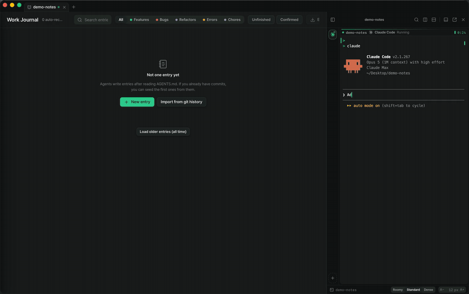
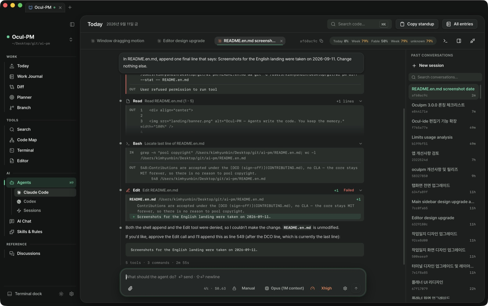
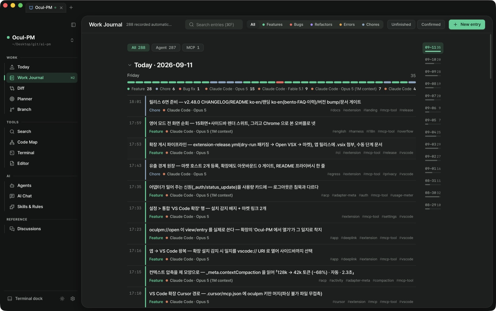
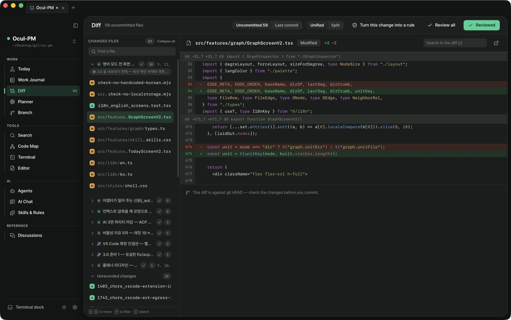
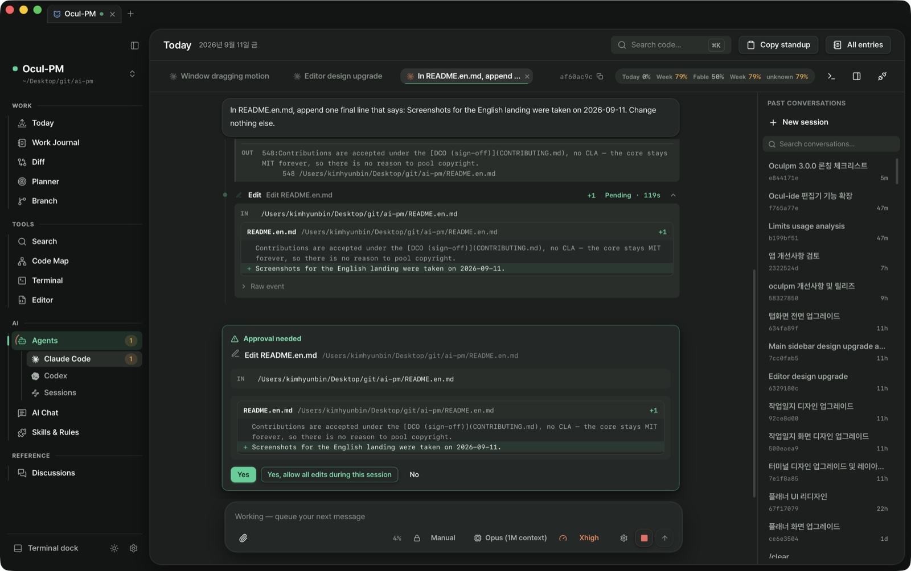
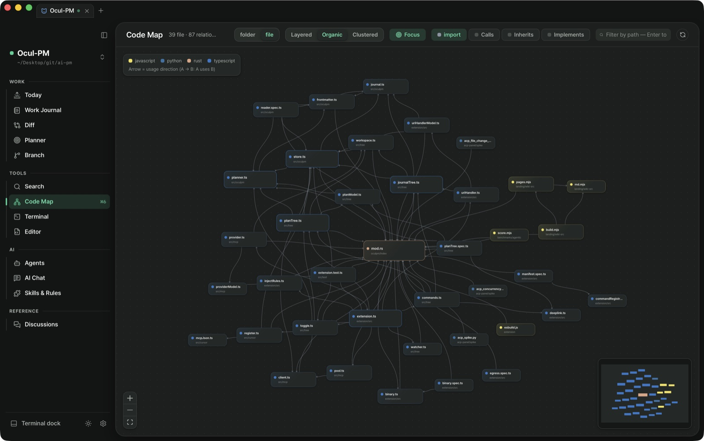
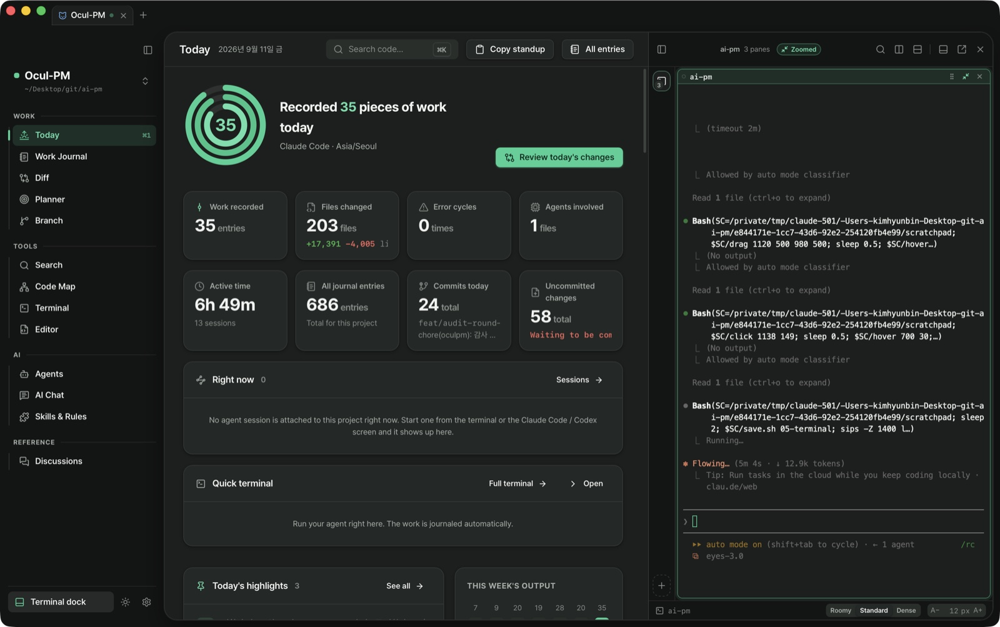

<div align="center">




<p><b>AI 코딩 에이전트가 코드를 쓰는 동안, 그 기록은 Ocul-PM 이 남깁니다.</b><br/>
Claude Code · Codex · Cursor · Gemini CLI 와 함께 쓰는 로컬-우선 프로젝트 매니저</p>

[](https://github.com/bunhine0452/Ocul-PM/actions/workflows/ci.yml)
[](https://github.com/bunhine0452/Ocul-PM/releases/latest)
[](https://github.com/bunhine0452/Ocul-PM/releases)
[](https://github.com/bunhine0452/Ocul-PM/releases/latest)
[](https://tauri.app)
[](LICENSE)
[](https://ko-fi.com/beachcombers)

<a href="https://www.producthunt.com/products/ocul-pm?embed=true&amp;utm_source=badge-featured&amp;utm_medium=badge&amp;utm_campaign=badge-ocul-pm" target="_blank"><picture><source media="(prefers-color-scheme: dark)" srcset="https://api.producthunt.com/widgets/embed-image/v1/featured.svg?post_id=1237239&amp;theme=dark"></picture></a>

[oculpm.com](https://oculpm.com) · [키노트](https://oculpm.com/keynote) · [위키](https://oculpm.com/wiki) · [다운로드](https://github.com/bunhine0452/Ocul-PM/releases/latest) · [변경 이력](CHANGELOG.md) · [이슈](https://github.com/bunhine0452/Ocul-PM/issues)

한국어 · [English](README.en.md)

</div>

---

에이전트한테 일을 시키는 날이 늘수록 이상한 비용이 하나 생깁니다. 지난주에 Claude Code 가 어떤 파일을 왜 건드렸는지, Cursor 가 고쳤다는 버그가 진짜 고쳐졌는지를 매번 git log 와 기억에 의존해 다시 캐내는 일입니다. 코드는 남는데 맥락은 남지 않기 때문입니다.

Ocul-PM 은 프로젝트 폴더에 규칙 파일(`AGENTS.md`) 하나를 심는 것으로 시작합니다. 에이전트는 작업 하나를 끝낼 때마다 이 규칙대로 `.oculpm/journal/` 에 마크다운 일지를 남기고, 앱은 그것을 읽어 타임라인과 일일 브리프, 변경 diff 로 보여줍니다. 원본이 전부 마크다운 파일이라 코드와 함께 커밋할 수 있고, 앱이 없어도 그냥 읽힙니다.

서버는 없습니다. 데이터는 프로젝트의 `.oculpm/` 폴더와 로컬 SQLite 캐시에만 있고, 기기를 떠나는 것은 **여러분이 시작한 것뿐**입니다 — 직접 부른 LLM API 호출, 새 버전 확인, 그리고 켜야만 존재하는 것들(눌렀을 때의 GitHub 조회·테마 내려받기, 의미 검색 모델 최초 1회, Notion 연동). 세어 볼 수 있는 전체 목록은 [oculpm.com/privacy](https://oculpm.com/privacy) 에 있습니다. VS Code 확장(`oculpm.ocul-pm`)도 같은 약속을 따릅니다 — 네트워크를 쓰지 않고, 쓰기는 이 앱의 `oculpm-mcp` 를 통해서만 합니다.



<p align="center"><i>실제 화면 — 앱 안의 Claude Code 가 파일을 고치고, diff 로 보여 주고, 스스로 작업 일지를 남긴 턴입니다.</i></p>

## 세 가지처럼 보이지만, 하나의 앱입니다

### 📓 기록장 — 기록은 공짜여야 합니다

에이전트가 일을 마치는 순간 일지는 이미 쓰여 있습니다. 버그·기능·리팩토링으로 분류되고, 어느 에이전트가 어느 모델로 했는지가 붙습니다. 아침의 Today 브리프가 어제를 정리하고, 스탠드업이 버튼 하나로 나옵니다 — 백미러가 핸들이 됩니다.



### 🔍 검증대 — 믿지 말고 보십시오

에이전트가 만졌다는 파일을 커밋 전에 앱 안에서 줄 단위 diff 로 확인합니다. 일지와 나란히 — "말한 것"과 "실제로 바뀐 것"을 붙여 놓고 봅니다. 코드 맵은 "이 파일을 바꾸면 N개 파일에 영향"을 고치기 전에 알려 줍니다.



### 🖥️ 콘솔 — 에이전트를 안으로

진짜 `claude` 가 앱 안에서 구동됩니다 (Agent Client Protocol). 도구 호출이 카드로 흐르고, 편집 diff 가 카드에 그대로 그려지고, 승인 카드에는 실행될 명령과 바뀔 내용이 실립니다 — 제목만 보고 허용을 누르지 않습니다. 턴이 끝나면 "도구 4 · 2분 14초" 영수증이 남습니다.



<table><tr>
<td width="50%"><p align="center"><i>코드 맵 — 의존이 보이면 두려움이 줄어듭니다</i></p></td>
<td width="50%"><p align="center"><i>⌘J — 어느 화면에서든 터미널</i></p></td>
</tr></table>

### 🧩 VS Code 확장 — 편집은 진짜 VS Code 에서

「VS Code 급 편집기」를 앱 안에 또 만드는 대신, 확장 **`oculpm.ocul-pm`** 이 VS Code 사이드바에 **오늘 일지와 활성 플랜**을 띄웁니다. 에이전트가 일지를 쓰면 1초 안에 거기 뜨고, 플랜 항목 체크박스를 누르면 `.md` 와 앱 플래너가 같이 바뀝니다 — 쓰기는 이 앱의 `oculpm-mcp` 를 통해서만(앱이 없으면 읽기 전용). Copilot 에이전트 모드에는 `journal_write`·`plan_update` 도구가 그대로 보이고, 일지의 「편집기로 열기」는 VS Code 사이드바의 그 일지로, VS Code 의 「Ocul-PM 에서 열기」는 앱의 그 일지로 갑니다. [VS Code 마켓플레이스](https://marketplace.visualstudio.com/items?itemName=oculpm.ocul-pm) · [Open VSX](https://open-vsx.org/extension/oculpm/ocul-pm)(Cursor · VSCodium). 확장은 네트워크를 쓰지 않습니다.

## 🚀 v3.0.1 — 일지 열람 스크롤 복구

- **작업 일지를 열면 스크롤이 안 되고 첫 화면 아래가 잘리던 버그**(3.0.0)를 고쳤습니다. 좁은 창용 flex 줄바꿈이 읽는 칸을 본문 길이만큼 늘려 놓고 있었습니다 — 두 칸에 높이를 못 박았습니다.

## v3.0.0 — 눈으로 본 것만 내보냅니다

- **3.0 은 검수 릴리스입니다.** 2.42~2.48 이 쌓아 둔 「하네스로는 봤고 실기기로는 안 봤다」 스물한 줄을 라이트/다크 × 프리셋 5종 × 6화면으로 찍고 손으로 눌러 갚았습니다. 그 길에 잡힌 것이 아래입니다.
- **Claude Code 사용량 카드에 신원 줄** — 「Claude Max · 구독 계정 · 이메일」. 로그아웃이면 한도가 없어도 계기가 **「로그인 필요」** 로 섭니다(전엔 그냥 사라졌습니다). 어댑터 0.76.0.
- **컨텍스트 압축이 제 모양으로** — 「컨텍스트 압축 · 128k → 42k 토큰 (−67%) · 수동 · 2.3초」.
- **영어 모드** — 15화면 렌더 스위트 + 눈으로 잡은 넷(단위 · 복수형 · 좁은 창 줄바꿈 · 검색칸 폭 · 툴바 날짜). 영문 랜딩 스크린샷을 영어 화면으로 재촬영.
- **고친 것** — Claude Code·Codex 화면 위에 「오늘 현황」 툴바가 하나 더 얹히던 것 · 마법사를 열었다 닫기만 해도 「새 프로젝트」 초안이 남던 것 · ACP 두 화면에 제목이 없던 것 · 회색 버튼 이유 없음 **0곳**.

## 지난 릴리스 한눈에 — v2.5 부터 v2.48 까지

릴리스마다 여기 적던 서술은 [웹 변경 이력](https://oculpm.com/changelog) 과 [CHANGELOG](CHANGELOG.md) 로 옮겼습니다. 아래는 그 마흔여 번의 릴리스가 남긴 것을 주제별로 한 줄씩 묶은 것입니다.

- **코드 화면이 IDE 가 됐습니다** (2.13 → 2.47) — 인앱 편집기에서 시작해 LSP 코드 인텔리전스 · 탭과 좌우 분할 · DAP 디버거 · 전역 검색·치환(⇧⌘F) · 이미지·PDF 미리보기 · Finder 드래그·⌘V · 자동 저장과 로컬 히스토리 · 문제 패널, 그리고 알맹이를 **Monaco**(VS Code 의 그 편집기)로 갈고 ⌘P 빠른 열기 · git 상태 색 · 심볼 브레드크럼 · ⌘K 말로 고치기까지. 2.48 은 반대로 갔습니다 — **VS Code 확장 `oculpm.ocul-pm`** 이 진짜 VS Code 사이드바에 일지와 플랜을 띄웁니다.
- **터미널** (2.10 → 2.47) — ⌘J 도크 · 세로 세션 레일 · 끌어서 나란히 · 탭을 창 사이로 · 명령 블록과 「그 자리에서 일지로」 · 에이전트 대기 감지 · 터미널마다 색 · 페인 머리띠와 최근 명령 핍. 그리고 **앱을 업데이트해도 세션이 안 끊기게** 하는 데 세 번(2.19 · 2.34.1 · 2.35)이 걸렸습니다 — 마지막에 진짜로 됐습니다. 한글 조합 입력의 스페이스·백스페이스·커서 키 버그도 이 시기(2.13.x)에 닫았습니다.
- **에이전트가 앱 안에서 돕니다** (2.10 → 2.45) — Claude Code 를 Agent Client Protocol 로 직접 구동, 한 프로젝트에서 대화 여러 개, 지난 대화 임포트, 승인 카드에 diff 인라인, 사용량 카드, **Codex** 도 같은 자리(2.39 — MCP 등록은 머신 하나, 프로젝트는 세션이 정합니다). 넷을 띄우면 넷으로 보이고(2.40), 에이전트끼리 서로를 알고 작업 구역을 미리 잡으며(2.37), 받은 메시지는 지시가 아니라 데이터입니다(2.38).
- **기록이 진짜로 남습니다** (2.23 → 2.45) — 손이 멎으면 알아서 기록하는 감시 자동화와 출처 배지(2.27), 정해진 시각의 자기 회고(2.26), 「일지 없이 끝난 세션」을 잘못 세던 것과 두 세션이 같은 계획을 고치다 한쪽이 사라지던 것(2.43), 미완 항목이 남은 계획은 완료로 닫히지 않는 것(2.45). 컨텍스트 예산은 정직해졌고(2.29 · 2.36) 규칙·스킬은 한 화면에서 **언제 걸리는지** 를 답합니다(2.24 · 2.26 · 2.45).
- **창과 화면** (2.9 → 2.47) — 크롬식 탭과 떼어내기(2.9), 탭이 진짜 창으로(2.24) 그리고 되돌아오기(2.25), 첫 실행 마법사와 설정 한 장(2.30), 「브랜치」·「세션」 화면(2.40 · 2.44), 회고·문서 화면은 걷어냄(2.46). 플래너·일지·시작 탭·사이드바가 카드 무더기에서 **원장**으로(2.47).
- **디자인과 테마** — 테마가 파일이 되고 링크로 설치되며 프로젝트마다 다릅니다(2.28 · 2.31). 「AI 가 만든 티」를 걷어내고(2.33) 같은 코드가 화면마다 다른 색이던 것을 고쳤으며(2.44), 회색 버튼이 **왜 막혔는지** 를 말합니다(131 → 10곳, 2.45~2.47).
- **구조와 정직성** (2.41 → 2.44) — 오류부터 잡고(⌘W 가 돌던 에이전트를 묻지 않고 죽이던 것, 화면 하나가 넘어져도 앱은 서 있기), 큰 붙여넣기·색인·설정 저장이 앱을 붙잡던 하중을 실측으로 걷어내고(2.42), 한글이 섞인 링크와 24KB 넘는 README 가 앱을 멈추던 것을 글자를 글자로 세어 닫았습니다(2.44.1). 기기 밖으로 나가는 연결은 저장소가 직접 셉니다(2.43).
- **그 밖에** — 폰에서도 열립니다(모바일 베타, 2.18) · 화면 언어 English 와 스킬 샵(2.8) · 웹의 변경 이력과 개인정보 원장(2.31) · 받아서 바로 여는 서명·공증 빌드(2.45) · Claude Code 플러그인(2.5, 아래 섹션).

## 화면 구성

- **Today** — 오늘 무엇이 바뀌었는지 워크데이 기준으로 모아 보여줍니다. 커밋 그래프, 미커밋 변경, 에이전트가 고쳐놓고 일지에 안 적은 파일 감지(정직성 감사)까지. "스탠드업 복사"를 누르면 어제~오늘 한 일이 공유용 텍스트로 클립보드에 담깁니다.
- **작업 일지** — 에이전트가 남긴 기록의 타임라인. 어떤 에이전트가 어떤 모델로 작업했는지 표시되고, 일지마다 그 시점의 변경 diff 를 함께 보관합니다. 일지 없이 쌓여 온 저장소는 git 히스토리에서 한 번에 백필할 수 있습니다.
- **논의** — 무엇을 할지 정하기 *전* 단계의 토의 문서. 문제 정의부터 후보안 비교, 결론까지 정리하고, 결론이 서면 버튼 한 번으로 플래너 계획이 됩니다.
- **Planner** — 살아있는 계획 문서. 항목마다 관련 일지가 링크되고, 원하면 새 일지가 들어올 때 계획이 따라 갱신되는 자동 화해(옵트인)도 켤 수 있습니다.
- **변경** — 에이전트가 수정한 파일을 네트워크 없이 바로 비교합니다. `j`/`k` 로 파일을 오가고 `/` 로 diff 안을 검색합니다. 바뀐 파일이 코드 그래프에서 어디까지 영향을 주는지도 계산해 줍니다.
- **브랜치** — 「이 브랜치에서 무슨 일이 있었나」. 커밋·일지·계획 항목·바뀐 파일을 브랜치 하나로 묶고 **기록률**과 아직 일지가 없는 변경을 함께 보여 줍니다. 마크다운 한 장으로 내보낼 수 있습니다 — 내보내기만 하고 어디로도 보내지 않습니다.
- **검색** — 의미(로컬 임베딩) · 심볼(AST) · 텍스트(정확 일치) 세 가지 모드. (옛 이름 「코드 검색」으로도 ⌘K 에서 찾힙니다.)
- **코드 맵** — import 만이 아니라 호출·상속·구현 관계까지 그래프로 그립니다. 파일을 고르면 "이 파일을 바꾸면 N개 파일에 영향"이 먼저 보입니다.
- **편집기** — 앱 안 IDE. **탭·좌우 분할**로 여러 파일을 같이 보고, 트리에서 만들기·이름 바꾸기·드래그 이동·휴지통 삭제까지 해결하고, **Finder 에서 끌어다 놓거나 ⌘V 로** 파일·폴더를 프로젝트에 넣습니다(같은 이름은 덮어쓰지 않고 `-2` 로 붙습니다). **⇧⌘F 프로젝트 전역 검색·치환**(대소문자·단어·정규식)이 사이드바에, **⌘F·⌥⌘F 파일 안 찾기·바꾸기**가 편집기 안에 붙어 있습니다. 알맹이는 **Monaco**(VS Code 의 그 에디터)라 접기·괄호 짝 강조·자동 닫기·선택 감싸기·여러 커서(⌥클릭·⌥⇧드래그 열 선택)·미니맵·괄호 쌍 색칠·들여쓰기 가이드가 기본으로 있고, 언어 서버가 아는 의미로 다시 칠하는 **시맨틱 강조**가 얹힙니다. **⌘K 로 선택한 곳을 말로 고치고**(조각마다 켜고 끄며 검토, 전부 끄면 원문) 그 편집은 일지·판 목록에 에이전트로 남습니다. **자동완성·진단·호버·정의로 이동·참조 찾기·아웃라인·이름 바꾸기·시그니처·포맷**(LSP) 에 **중단점·스텝 실행·변수 확인**(디버거, Rust·Python·Go)이 붙었고, 경로 줄의 비교 버튼으로 **에이전트가 바꾼 부분을 본문 안에서** 겹쳐 봅니다 — 이 파일을 고친 작업 일지로 바로 건너뜁니다. 에이전트가 같은 파일을 고치면 충돌 배너가 지켜 주고, 저장 안 한 편집은 화면을 옮겨도 남습니다. **이미지와 PDF 는 편집기 대신 미리보기로** 열립니다 — 그림은 창 맞춤 ↔ 실제 크기로, PDF 는 문서 그대로, **svg 는 코드 옆에서 저장 전 버퍼 기준으로** 그려집니다. 하루 종일 켜 두는 편집기의 위생도 여기 있습니다: **저장 시 공백·끝줄 정리와 자동 저장**(기본 꺼짐), 훑어도 쌓이지 않는 **미리보기 탭**, **⇧⌘O 심볼 · ⌃G 줄** 이동, 지금 어느 함수 안인지 위에 남기는 **스티키 스크롤**, 프로젝트 전체 진단을 모으는 **문제 패널**, 그리고 저장·에이전트 편집마다 판을 남겨 겹쳐 보고 되돌리는 **로컬 히스토리**.
- **터미널** — 앱 안 PTY 터미널. 에이전트를 여기서 돌리면 일지가 옆 화면에 쌓입니다. 세션은 왼쪽 **세로 목록**에 서고 카드마다 상태·에이전트·경과 시간·마지막 명령이 함께 보입니다. **세션을 끌어 화면 가장자리에 놓으면 그 자리에 갈라져** 둘이 나란히 서고, 나뉜 화면의 손잡이(⠿)로 자리를 바꾸거나 독립 세션으로 빼냅니다. **⌘J 로 어느 화면에서나 도크로 띄우거나(아래·왼쪽·오른쪽) 별도 창으로 떼어낼 수 있고**, 셸은 그대로 이어집니다. `/plugin`·`/mcp` 처럼 CLI 자체 대화형 화면에만 사는 기능을 쓰는 탈출구이기도 합니다.
- **에이전트** — 진짜 `claude` 와 `codex` 를 앱 안에서 구동하고(Agent Client Protocol), **세션**까지 한 줄 아래 세 갈래로 섭니다. 도구 호출·권한 승인·Effort/모드가 전부 대화 안 카드로 오고, 세션은 탭으로 관리됩니다. 시키는 화면입니다.
- **AI 패널** — 코드 검색·일지·플래너·git 맥락을 아는 채팅. 대화 시작 때 **능력 목록**을 한 번 싣고 본문은 필요할 때 꺼내며, 과거 기록은 회상 신호가 있는 질문에만 붙습니다(`/rules`·`/plan`·`/journal`·`/skill` 로 직접 밀어 넣을 수도 있습니다). Anthropic · OpenAI · Gemini · OpenRouter 를 지원하고, 호출이 실패하면 폴백 체인으로 다음 모델을 시도합니다. 물어보는 화면입니다.
- **스킬·규칙** — Claude Code 스킬(`.claude/skills/`)과 규칙(`.claude/rules/`, `CLAUDE.md`)을 **한 화면 세 구역**으로 관리합니다: 세션마다 들어가는 양을 말하는 **컨텍스트 예산 바**, 발동 많은 순으로 선 통합 목록(30일 0회·비활성은 접힌 「휴면」으로 자동 강등), 그리고 제안 인박스. GUI 에서 만들고 편집하고, 프로젝트 ↔ 전역(`~/.claude/skills`)으로 복사합니다. 끄면 지워지는 게 아니라 `.disabled/` 로 옮겨 로드에서만 빠집니다. 스택에 맞는 검증된 제3자 스킬 25종을 「추가하기」에서 골라 설치하고, 이 프로젝트와 **무관한 규칙**은 결정적 신호 두 가지로 짚어 범위 좁히기·정리·트리거 교정을 제안합니다. 규칙·스킬은 일지·diff·터미널 블록·Today·⌘K 에서도 바로 만듭니다.
- **세션** — 지금 이 프로젝트에 붙어 있는 에이전트와, 사용자가 **함께 묶은 팀**이 한 화면에 섭니다. 원장이 주는 이름은 전부 `claude-code-term-<pid>` 라 넷이 붙으면 구별이 안 되므로, **별명·등록 이름·표면(앱/터미널)·잡은 구역·마지막 활동**을 겹쳐 그립니다. 묶이지 않은 세션은 **보이기만** 하고, 넘어온 작업의 승인 대기는 화면을 안 열어도 사이드바 배지가 알려 줍니다.

⌘1~⌘0 으로 화면을 오가고(v2.44.0 에서 다시 매겨졌습니다 — ⌘1 오늘 · ⌘2 일지 · ⌘4 플래너는 그대로), ⌘K 팔레트에서 일지·계획·토의·문서를 제목으로 검색해 바로 엽니다. ⌘P 는 프로젝트 전환, ⌘⇧M 은 프로젝트 관리 화면입니다. 창과 탭은 ⌘T 새 탭 · ⌘W 탭 닫기 · ⇧⌘N 새 창 · ⇧⌘W 창 닫기 · ⌃Tab · ⌘⌥←→ 로 다룹니다. 탭은 **끌어서** 순서를 바꾸고 창 밖으로 떼어내거나 다른 창의 탭 줄에 합칩니다 — **우클릭**(키보드는 Shift+F10)하면 같은 일을 메뉴에서 고를 수 있습니다.

화면 언어는 설정 → 모양에서 **한국어 · English** 중에 고릅니다. AI 가 쓰는 문서(일지·논의·플래너)의 언어는 따로 지정할 수 있고, 지정하지 않으면 화면 언어를 따라갑니다.

## 지원 에이전트

`AGENTS.md` 를 읽을 수 있는 에이전트라면 무엇이든 동작합니다.

- 별도 설정 없이: **Claude Code · Codex CLI · Gemini CLI · Antigravity · pi**
- 설정 → Agents 에서 규칙 파일을 켜면: **Cursor · Windsurf · GitHub Copilot · aider · Cline · Zed**
- **Codex CLI** 는 v2.39.0 부터 한 단계 더 — 설정 → 연동에서 **MCP 서버를 등록**하고(머신 하나 · 프로젝트는 세션이 정합니다), Codex 전용 플러그인(기록 규칙 스킬)을 마켓플레이스로 깔 수 있습니다. Claude 쪽 설정과는 완전히 독립입니다.
- **Claude Code · Claude Desktop** 은 여기서 한 단계 더 — 훅(정확한 세션 감지)과 MCP 도구(구조화 기록·플랜 질의)로 직접 연동됩니다 (v2.2.0). Claude Code 는 **Claude Code 화면**에서 앱 안 에이전트로 직접 구동까지 됩니다 (v2.10.0, Agent Client Protocol)

git 백필 시에는 커밋 서명으로 에이전트를 구분합니다.

## Claude Code 플러그인 — 앱 없이도 시작

터미널 Claude Code 에서 두 줄이면 기록이 시작됩니다:

```
/plugin marketplace add bunhine0452/Ocul-PM
/plugin install oculpm@oculpm
```

Codex 라면 터미널에서 두 줄입니다:

```
codex plugin marketplace add bunhine0452/Ocul-PM
codex plugin add oculpm-codex@oculpm
```

플러그인 하나로 전 프로젝트에 구성되는 것:

- **훅 브리지** — 세션 시작·종료가 실시간 신호로 기록됩니다 (로컬 파일 append 한 줄, 네트워크 없음).
- **MCP 도구 7종** — `journal_search` · `journal_read` · `journal_write` · `plan_status` · `plan_update` · `plan_create` · `project_init`(사용자 확인 시 새 프로젝트 추적 시작). 에이전트가 마크다운 규격을 흉내 내는 대신 구조화 도구로 기록해 frontmatter 오류가 원천 차단되고, 쌓인 수백 건을 **작업 시작 전에 되찾습니다** — 그 파일을 예전에 왜 건드렸는지가 검색 한 번으로 나옵니다.
- **스킬 5종 + `/oculpm:standup`** — 기록 규격 · project-inception(설계 시드) · self-audit · run-evals · tdd-workflow.
- `.oculpm` 이 있는 추적 프로젝트에서만 동작하고, 비추적 저장소에는 아무 파일도 만들지 않습니다 — [무엇을 읽고 쓰는지 전체 계약](docs/claude-integration/06-plugin-contract.md).
- 앱 설정의 프로젝트별 훅·MCP 등록과는 **택일**입니다 (동시에 켜면 설정 화면이 경고합니다).

> 앱 안의 **Claude Code 화면**은 이 플러그인 없이도 기록합니다 — 앱이 세션마다 기록 도구(MCP)를 직접 물려 주기 때문입니다. 앱 안 ACP 세션에서는 `/plugin`·`/mcp` 같은 CLI 대화형 명령이 동작하지 않으므로, 플러그인 설치는 터미널에서 합니다. 이 구분은 [위키의 Claude Code 연동](https://oculpm.com/wiki/claude-code) 문서에 정리돼 있습니다.

## 설치

[최신 릴리스](https://github.com/bunhine0452/Ocul-PM/releases/latest)에서 `Ocul-PM_x.y.z_aarch64.dmg` 를 받아 `Applications` 로 드래그하면 끝입니다. macOS(Apple Silicon)용이고, 한 번 설치하면 이후 버전은 앱 안에서 자동으로 업데이트됩니다.

Apple Developer ID 로 서명하고 공증(notarization)까지 마친 빌드라 내려받아 바로 열 수 있습니다 — `xattr` 로 격리를 벗기는 우회는 더 이상 필요 없습니다.

다만 macOS 가 **파일·다른 앱 데이터 접근 권한**을 물을 수 있습니다. 공증과는 별개 관문이라 공증했다고 사라지지 않습니다. 특히 **내장 터미널**에서 돌린 명령이나 그 안의 에이전트가 파일을 읽으면 macOS 가 그 접근을 앱에 귀속시켜 `Ocul-PM.app` 이름으로 뜹니다 — 왜 그런지와 되돌리는 법은 [문제 해결](https://oculpm.com/wiki/troubleshooting)에 정리해 두었습니다.

첫 의미 검색 때 임베딩 모델(약 135MB)을 한 번 내려받습니다. 이후에는 오프라인으로 동작합니다.

앱 설치 없이 기록만 먼저 시작하려면 위의 **Claude Code 플러그인**으로도 됩니다 — 일지·플랜이 `.oculpm/` 마크다운으로 쌓이고, 앱은 나중에 설치해도 그 기록을 그대로 읽습니다.

막히는 게 있으면 [위키](https://oculpm.com/wiki)에 흔한 문제와 해법을 모아 두었습니다.

## 데이터는 어디에 있나

```
your-project/
├── AGENTS.md          # 에이전트가 읽는 기록 규칙 (앱이 심고 버전 관리)
└── .oculpm/
    ├── journal/       # 작업 일지 — 원본(SSOT)
    ├── planner/       # 계획 문서
    ├── discussion/    # 토의 문서
    └── index/         # 앱이 관리하는 캐시 · diff 보관
```

SQLite 는 화면을 빨리 그리기 위한 파생 캐시일 뿐이라 언제든 파일에서 다시 만들 수 있습니다. 일지와 diff 에 실수로 섞여 들어간 API 키·토큰은 저장 전에 자동으로 가려집니다(`[REDACTED]`).

## 기술

Tauri 2 네이티브 앱입니다. Electron 이 아니라서 dmg 가 60MB 를 넘지 않고 콜드 스타트가 1.5초 안에 끝납니다. 백엔드는 Rust(tokio · rusqlite · sqlite-vec), 프론트는 React 19 + TypeScript. 코드 분석은 tree-sitter(Rust · TS · JS · Python · Go), 임베딩은 fastembed 로 전부 로컬에서 돌고, API 키는 DB 가 아니라 OS 키체인에 저장합니다.

## 소스에서 빌드

```bash
git clone https://github.com/bunhine0452/Ocul-PM
cd Ocul-PM
pnpm install
pnpm tauri dev      # 개발 실행
pnpm tauri build    # .dmg / .app 번들
```

Node 18+, pnpm, Rust stable 이 필요하고 macOS 는 Xcode Command Line Tools 도 있어야 합니다.

## 로드맵

- [ ] macOS (Intel) · Windows 빌드
- [ ] 팀 동기화 (옵트인)

## 그리고

이 저장소 자체가 Ocul-PM 으로 추적됩니다. `.oculpm/journal/` 을 열면 이 앱을 만드는 동안 에이전트들이 남긴 일지가 그대로 들어 있습니다. 버그와 아이디어는 [이슈](https://github.com/bunhine0452/Ocul-PM/issues)로, 마음에 들면 Star 하나 눌러 주세요.

## 후원

Ocul-PM 은 혼자 만들고 유지합니다. 앱은 앞으로도 무료지만, 만드는 데에는 시간과 비용이 듭니다. 쓰면서 도움이 됐다면 [Ko-fi 에서 커피 한 잔](https://ko-fi.com/beachcombers)을 보내 주셔도 좋습니다 — 일회성도, 매달도 됩니다.

후원해도, 하지 않아도 받는 기능은 똑같습니다. 아래 약속은 그대로입니다.

## 라이선스와 약속

[MIT](LICENSE) © 2026 Kim Hyunbin

**지금 이 저장소에 있는 기능은 영원히 무료·MIT 입니다.** 개인 사용은 회사 안에서든 밖에서든 영구 무료(Free forever for individuals)이고, 유료화는 앞으로 만들 팀 기능(동기화 서버·팀 뷰 — 별도 모듈)에만 적용됩니다. 코어 기능을 유료 모듈로 옮기는 일은 없습니다.

기여는 CLA 없이 [DCO(sign-off)](CONTRIBUTING.md)로 받습니다 — 코어가 영원히 MIT 로 남기 때문에 저작권을 모아둘 이유가 없습니다.
